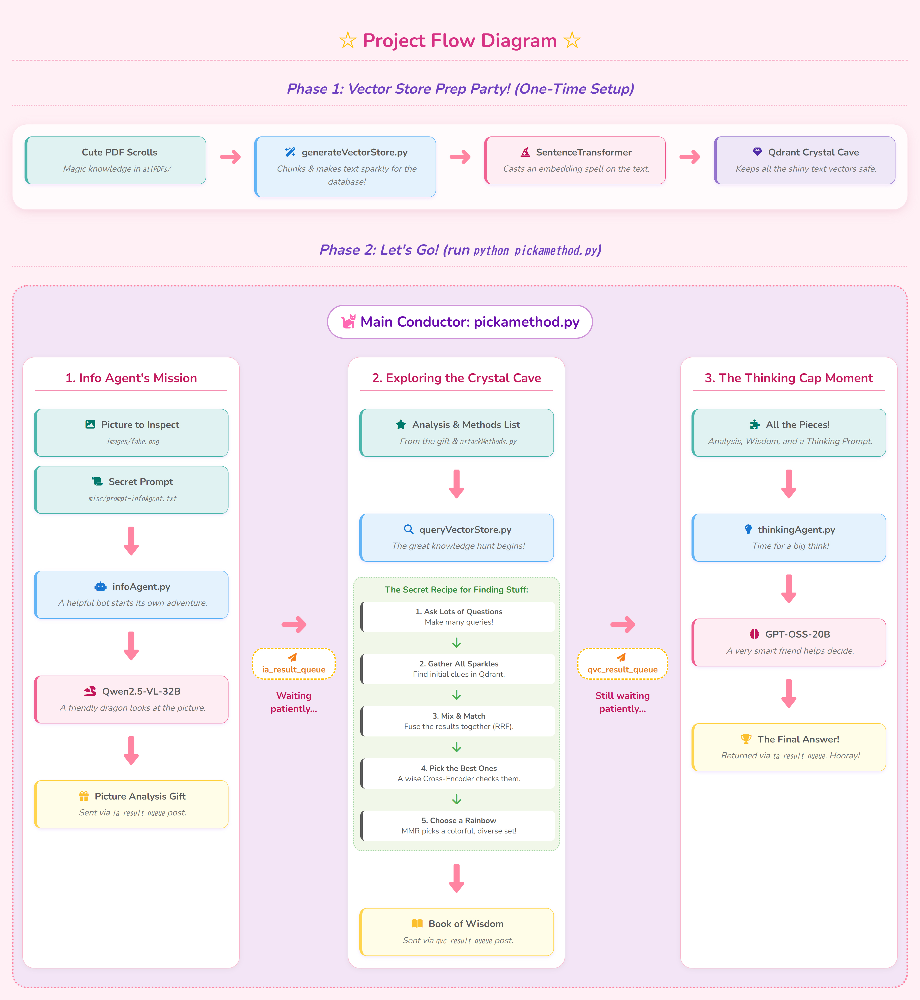

**Setting Up Conda Env:**
- conda create --name magentaa-attackerside python=3.11.13
- conda activate magentaa-attackerside

**Installing Packages:**
- pip install torch torchvision --index-url https://download.pytorch.org/whl/cu128
- - or on linux: pip install torch torchvision
- pip install git+https://github.com/huggingface/transformers accelerate
- pip install qwen-vl-utils[decord]==0.0.8 bitsandbytes safetensors
- pip install kernels sentence_transformers qdrant_client

**Quick Run:**
- python pickamethod.py

